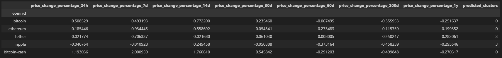
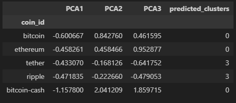
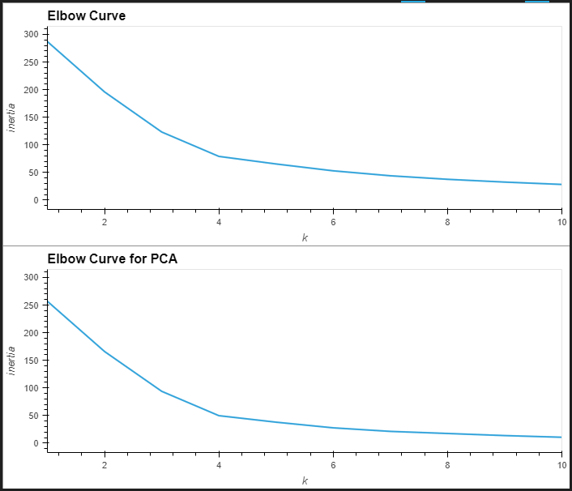
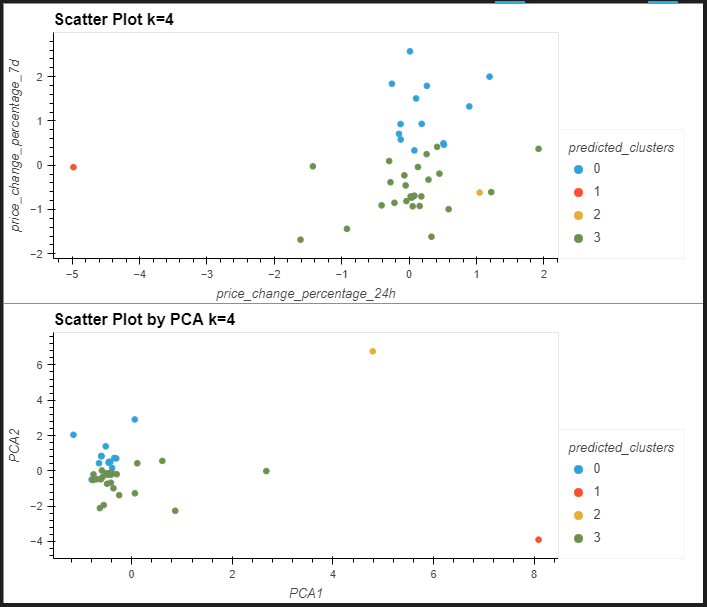

# CryptoClustering
Module 19 Challenge

This challenge determines if cryptocurrencies are affected by 24-hour or 7-day price changes.

_________________________________________________________

## INCLUDED IN THIS REPOSITORY:

- Images folder containing screenshots of analysis for reference
- Resources folder containing source file crypto_market_data.csv
- Crypto_Clustering.ipynb - Jupyter Notebook file containing analysis

_________________________________________________________

## REFERENCES

- Creating composite plots https://holoviz.org/tutorial/Composing_Plots.html

_________________________________________________________

## ANALYSIS

### Preparing the data

The data was prepared by scaling and reformatting the index by crypto name, see image below for reference.

### Original scaled data

* The elbow method was used to find the best value of `k`, which was `4` when visualizing the elbow curve and also when verified using the Calinski Harabasz Score.

* A KMeans model was initialized, fit, and used to predict groupings.  This was visualized using a scatterplot.

### Data optimization using PCA

* A PCA model was created using 3 components, which accounted for 89.5% of the original data.  This data also used the crypto name as the index, see image below for reference.

* The elbow method was repeated using the PCA data and the best value of `k` remained `4`, so it did not differ from the value when using the original data.

* A KMeans model was used for PCA as well and was visualized using a scatter plot.

### Summary and comparison

* When comparing the elbow curves created using both the original data and the PCA data, they were found to be very similar.  Using fewer features to cluster the data did not appear to impact the best value of `k`.

* The scatter plot created using fewer features (PCA model) did have more clearly defined segments, while retaining almost 90% of the data. It appeared to improve the predicted clusters.

